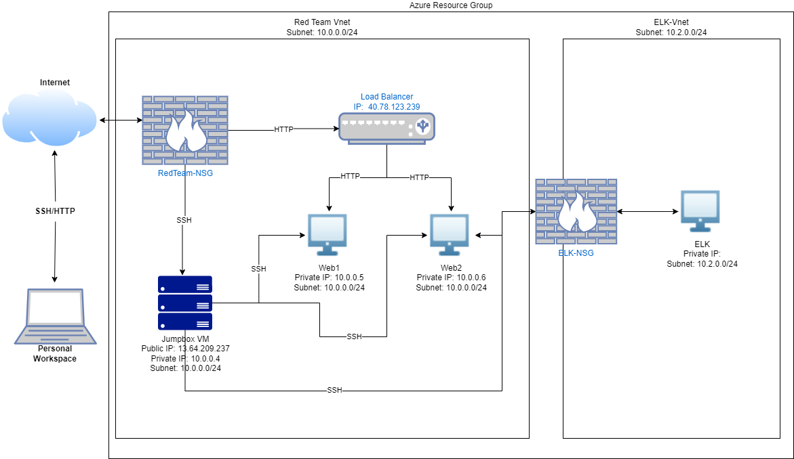
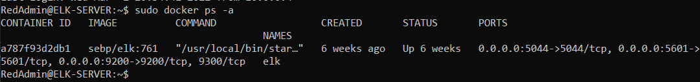

## Automated ELK Stack Deployment

The files in this repository were used to configure the network depicted below.

These files have been tested and used to generate a live ELK deployment on Azure. They can be used to either recreate the entire deployment pictured above. Alternatively, select portions of the `yml` file may be used to install only certain pieces of it, such as Filebeat.

  - [filebeat-playbook](ansible/filebeat-playbook.yml)
  - [metricbeat-playbook](ansible/metricbeat-playbook.yml)

This document contains the following details:
- Description of the Topologu
- Access Policies
- ELK Configuration
  - Beats in Use
  - Machines Being Monitored
- How to Use the Ansible Build

### Description of the Topology

The main purpose of this network is to expose a load-balanced and monitored instance of DVWA, the D*mn Vulnerable Web Application.

Load balancing ensures that the application will be highly `available and redundant`, in addition to restricting `access` to the network.
- _What aspect of security do load balancers protect? What is the advantage of a jump box?_
  - Load balancers protect availability of servers. The advantage of a jumpbox is to strengthen the security of accessing the webservers through SSH. They must sign in through the jumpbox first thus reducing the number of attack vectors on the web server.

Integrating an ELK server allows users to easily monitor the vulnerable VMs for changes to the `configurations` and `system files`.
- _What does Filebeat watch for?_
  - Filebeat monitors for linux account logins, ssh logins, and sudo commands.
- _What does Metricbeat record?_
  - Metricbeat will monitor for CPU, RAM, and network usage.

The configuration details of each machine may be found below.
_Note: Use the [Markdown Table Generator](http://www.tablesgenerator.com/markdown_tables) to add/remove values from the table_.

| Name     | Function | IP Address | Operating System |
|----------|----------|------------|------------------|
| Jump Box | Gateway  | 10.0.0.4   | Linux            |
| Web-1     | Web Servers         |  10.0.0.5     |Linux           |
| Web-2    | Web Servers         |   10.0.0.6 |  Linux                |
| Elk-VM    | SIEM         |   10.2.0.4     |   Linux               |

### Access Policies

The machines on the internal network are not exposed to the public Internet. 

Only the `jumpbox and web server` machine can accept connections from the Internet. Access to this machine is only allowed from the following IP addresses:
- _Access to Jumpbox from the internet is limited to my personal IP_
- Access to the webserver is through the load balancer only.

Machines within the network can only be accessed by `jumpbox.
- _Which machine did you allow to access your ELK VM? What was its IP address?_
  - We allowed the jumpbox only to access the ELK VM and its IP address is 10.0.0.4

A summary of the access policies in place can be found in the table below.

| Name     | Publicly Accessible | Allowed IP Addresses |
|----------|---------------------|----------------------|
| Jump Box | No              | My Personal IP   |
| Web-1         |    Yes                 |   Load Balancer/10.0.0.4                  |
| Web-2         |    Yes                 |    Load Balancer/10.0.0.4                  |
| ELK-VM      |      No               |  10.0.0.4                    |

### Elk Configuration

Ansible was used to automate configuration of the ELK machine. No configuration was performed manually, which is advantageous because...
- _What is the main advantage of automating configuration with Ansible?_
  - The main advantage of Ansible is to automate the process faster and less prone to human errors when installing software to multiple servers at the same time.

The playbook implements the following tasks:
- _In 3-5 bullets, explain the steps of the ELK installation play. E.g., install Docker; download image; etc._
- Install docker
- Install python and pip module
- Increase more memory for ELK usage
- Install elk container, modify ports
- Enable on startup

The following screenshot displays the result of running `docker ps` after successfully configuring the ELK instance.

### Target Machines & Beats
This ELK server is configured to monitor the following machines:
- Web 1 10.0.0.5 and Web 2 10.0.0.6

We have installed the following Beats on these machines:
-Filebeat and metricbeat

These Beats allow us to collect the following information from each machine:
- Filebeat will allow us to monitor ssh sudo commands and linux account logins. Metricbeat will monitor for cpu, ram and network usuage.  

### Using the Playbook
In order to use the playbook, you will need to have an Ansible control node already configured. Assuming you have such a control node provisioned: 

SSH into the control node and follow the steps below:
- Copy the yml file file to etc/ansible.
- Update the config file to include the elk server ip.
- Run the playbook, and navigate to _/etc/ in targeted machine to check that the installation worked as expected.

_TODO: Answer the following questions to fill in the blanks:_
- _Which file is the playbook?_
  - Filebeat-playbook and metricbeat-playbook 
- _Where do you copy it?_ 
  - The etc/anisble container.
- _Which file do you update to make Ansible run the playbook on a specific machine?_ 
  - Host file 
- _How do I specify which machine to install the ELK server on versus which to install Filebeat on?_
  - Inside the host file we had to speciy specific ip groups.
- _Which URL do you navigate to in order to check that the ELK server is running?_
  - Http://elkurl:5601

_As a **Bonus**, provide the specific commands the user will need to run to download the playbook, update the files, etc._

